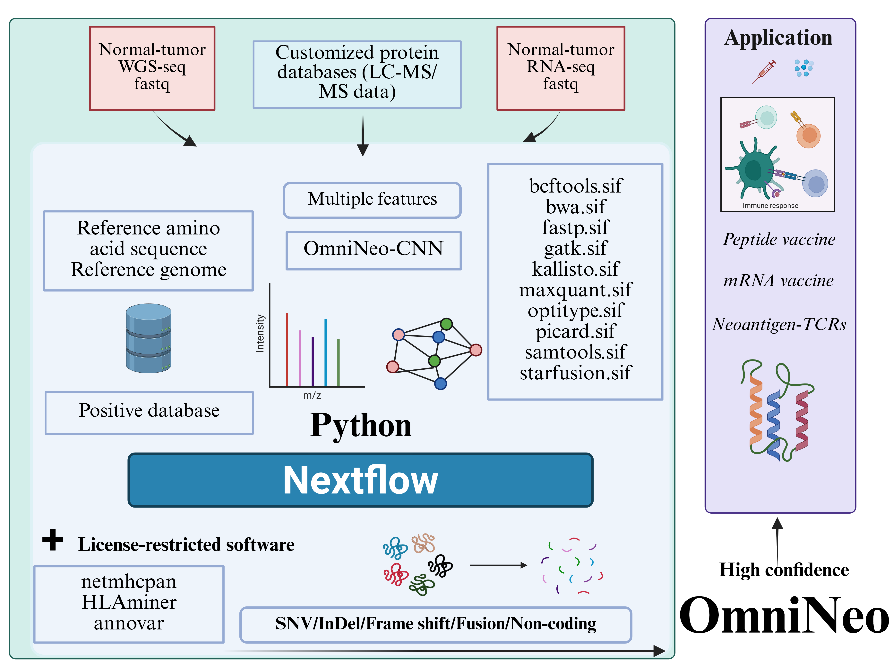

# OmniNeo: A Nextflow Pipeline for Neoantigen Prediction

## Overview

OmniNeo is an automated, multi-omics neoantigen discovery framework that integrates WGS/WES, transcriptomic, and proteomic data. Using Nextflow, it enables efficient task execution across various compute infrastructures, with Singularity containers ensuring reproducibility. The pipeline identifies potential neoantigens through comprehensive DNA and RNA analysis, HLA typing, and variant processing.



## Table of Contents

1. [Features](#features)
2. [Hardware Requirements](#hardware-requirements)
3. [Installation](#installation)
   - [Nextflow](#nextflow)
   - [Singularity](#singularity)
   - [Required Software](#required-software)
4. [Pipeline Configuration](#pipeline-configuration)
5. [Usage](#usage)
   - [Sample Sheet Format](#sample-sheet-format)
   - [Basic Command](#basic-command)
   - [Advanced Usage](#advanced-usage)
6. [Pipeline Modules](#pipeline-modules)
   - [DNA Analysis](#dna-analysis)
   - [RNA Analysis](#rna-analysis)
   - [HLA Typing](#hla-typing)
   - [Downstream Analysis](#downstream-analysis)
   - [MS Database Generation](#ms-database-generation)
7. [Output Structure](#output-structure)
8. [Troubleshooting](#troubleshooting)
9. [Citations](#citations)
10. [License](#license)
11. [Contact](#contact)

## Features

OmniNeo provides:

- Multi-omics integration (DNA, RNA, and optionally proteomics)
- Automated end-to-end processing from raw sequencing data to neoantigen candidates
- Modular design for flexible execution of selected analysis components
- Comprehensive HLA typing (Class I with OptiType and Class II with HLAminer)
- High-quality variant calling and filtration
- Transcriptomic validation of neoantigens
- Identification of frameshift, non-frameshift, and fusion-derived peptides
- MS database generation for proteomics validation

## Hardware Requirements

OmniNeo is designed to run on high-memory, multi-core servers:

- **Recommended**: >16 cores, minimum 128GB RAM, >2TB of free disk space
- **Optimal environment**: HPC cluster with multiple compute nodes 

> **Note**: By adjusting the memory and CPU parameters in `base.config` and `nextflow.config`, it is possible to run OmniNeo on systems with lower resources, but processing time will increase significantly.

## Installation

### Nextflow

Install Nextflow using one of the following methods:

```shell
# Method 1: Direct installation
curl -s https://get.nextflow.io | bash

# Method 2: Using conda
conda install bioconda::nextflow
```

For more information, see the [Nextflow installation guide](https://www.nextflow.io/docs/latest/install.html#install-page).

### Singularity

Install Singularity using one of the following methods:

```shell
# Method 1: Standard installation
export VERSION=1.13 OS=linux ARCH=amd64
wget https://dl.google.com/go/go$VERSION.$OS-$ARCH.tar.gz
sudo tar -C /usr/local -xzvf go$VERSION.$OS-$ARCH.tar.gz
rm go$VERSION.$OS-$ARCH.tar.gz 

echo 'export PATH=/usr/local/go/bin:$PATH' >> ~/.bashrc
source ~/.bashrc

export VERSION=3.5.3
wget https://github.com/sylabs/singularity/releases/download/v${VERSION}/singularity-${VERSION}.tar.gz
tar -xzf singularity-${VERSION}.tar.gz
cd singularity

./mconfig
make -C builddir
sudo make -C builddir install

# Method 2: Using conda (no sudo required)
conda install conda-forge::singularity
```

For more information, see the [Singularity installation guide](https://docs.sylabs.io/guides/3.5/user-guide/quick_start.html).

### Required Software

The pipeline uses the following tools, provided as Singularity containers:

- fastp (Quality control and adapter trimming)
- bwa (Read alignment)
- samtools (SAM/BAM manipulation)
- gatk4 (Variant calling and processing)
- picard (BAM file processing)
- kallisto (RNA quantification)
- maxquant (Proteomics analysis)
- optitype (HLA Class I typing)
- star-fusion (Fusion detection)
- bcftools (VCF manipulation)
- Python packages for downstream analysis

**License-Restricted Software:**
Due to licensing restrictions, you must download and install the following software separately:

- annovar (Variant annotation)
- HLAminer (HLA Class II typing)
- netmhcpan, netmhcpanii and nettcl (MHC binding)

After installing these tools, set their paths in `nextflow.config`.

## Pipeline Configuration

Before running the pipeline, review and edit these configuration files:

1. **nextflow.config**: Contains default parameter settings, container paths, and resource configurations
2. **conf/base.config**: Contains process-specific configurations (CPUs, memory)

Key parameters to check in `nextflow.config`:
- `params.samplesheet`: Path to your input sample sheet
- `params.outdir`: Output directory
- `params.hg38db`: Reference genome path
- `params.optitype`: HLA Class I typing configuration
- `params.hlaminer`: HLA Class II typing configuration
- `params.bwa`: BWA alignment configuration
- Container paths for all tools
- Database and resource paths

## Usage

### Sample Sheet Format

Prepare a tab-separated (TSV) sample sheet with the following columns:

```
sampleID  DNANormalReads1  DNANormalReads2  DNATumorReads1  DNATumorReads2  RNANormalReads1  RNANormalReads2  RNATumorReads1  RNATumorReads2
L041      path/to/L041_dna_normal_R1.fq.gz  path/to/L041_dna_normal_R2.fq.gz  path/to/L041_dna_tumor_R1.fq.gz  path/to/L041_dna_tumor_R2.fq.gz  path/to/L041_rna_normal_R1.fq.gz  path/to/L041_rna_normal_R2.fq.gz  path/to/L041_rna_tumor_R1.fq.gz  path/to/L041_rna_tumor_R2.fq.gz
```

See `example_samplesheet.tsv` for reference.

### Basic Command

Once all parameters are configured in `nextflow.config`, run:

```shell
nextflow run main.nf -profile singularity
```

### Advanced Usage

For help and to see all available options:

```shell
nextflow run main.nf --help
```

Common parameter overrides:

```shell
# Specify different output directory
nextflow run main.nf --outdir /path/to/custom/output -profile singularity

# Skip DNA or RNA analysis
nextflow run main.nf --skip_dna -profile singularity
nextflow run main.nf --skip_rna -profile singularity

# Adjust resources
nextflow run main.nf --max_cpus 32 --max_memory 256.GB -profile singularity
```

## Pipeline Modules

### DNA Analysis

The DNA analysis pipeline includes:

1. **Quality Control (fastp)**: Adapter trimming and quality filtering
2. **Alignment (BWA)**: Read alignment to the reference genome
3. **BAM Processing**:
   - Fixmate and sorting (samtools)
   - Mark duplicates (GATK)
   - Add/replace read groups
   - Base quality score recalibration
4. **Variant Calling**:
   - Mutect2 for somatic variant detection
   - Variant filtering
5. **Variant Annotation (ANNOVAR)**

### RNA Analysis

The RNA analysis pipeline includes:

1. **Quality Control (fastp)**: Adapter trimming and quality filtering
2. **Alignment**: Read alignment to the reference genome
3. **Alternative Processing**:
   - STAR-Fusion for fusion gene detection
   - Kallisto for transcript quantification
4. **Variant Calling**:
   - RNA-specific variant detection
5. **HLA Typing**:
   - OptiType for Class I HLA typing
   - HLAminer for Class II HLA typing
   
### HLA Typing

OmniNeo integrates two complementary HLA typing methods:

1. **HLA Class I Typing (OptiType)**:
   - Extracts HLA-specific reads using Razers3
   - Converts BAM to FASTQ format
   - Predicts HLA-A, HLA-B, and HLA-C types

2. **HLA Class II Typing (HLAminer)**:
   - Aligns RNA-seq reads to HLA reference sequences using BWA
   - Performs HLA prediction using HLAminer
   - Identifies HLA-DRB, HLA-DQA, HLA-DQB, and other Class II alleles

### Downstream Analysis

Downstream analysis processes identified variants to predict potential neoantigens:

1. **DNA Downstream Analysis**:
   - SNV analysis
   - Frameshift insertion/deletion analysis
   - Non-frameshift insertion/deletion analysis
   - Non-frameshift substitution analysis
   - Stoploss mutation analysis

2. **RNA Downstream Analysis**:
   - TPM filtering based on gene expression
   - Non-coding region analysis
   - Fusion peptide generation
   - Integration of multiple peptide sources

### MS Database Generation

The MS Database generation module combines peptides from multiple sources into a unified database for mass spectrometry analysis:

1. **DNA-derived peptides**:
   - Frameshift deletion junction peptides
   - SNV-derived peptides
   - Non-frameshift deletion/insertion peptides
   - Other mutation-derived peptides

2. **RNA-derived peptides**:
   - Non-coding region peptides (long and short)
   - Fusion-derived peptides

3. **Reference databases**:
   - CRAP (Common Repository of Adventitious Proteins)
   - UniProt reference database

## Output Structure

The pipeline generates output in the following structure:

```
<outdir>/
├── <sample_id>/
│   ├── dna/
│   │   ├── 01_fastp/                  # Quality control results
│   │   ├── 02_bwa/                    # Alignment results
│   │   ├── 03_samtools/               # Sorted and indexed BAM files
│   │   ├── 04_gatk/                   # Variant preprocessing
│   │   ├── 06_mutect2/                # Somatic variant calling
│   │   ├── 07_annovar/                # Variant annotation
│   │   └── 08_integrated/             # Integrated DNA peptide results
│   │
│   ├── rna/
│   │   ├── 01_fastp/                  # RNA quality control
│   │   ├── 02_bwa/                    # RNA alignment results
│   │   ├── 03_star_fusion/            # Fusion detection
│   │   ├── 05_kallisto/               # Transcript quantification
│   │   ├── 09_hla_typing/             # HLA Class I typing results
│   │   ├── 09_hla_typingii/           # HLA Class II typing results
│   │   └── 10_integrated/             # Integrated RNA peptide results
│   │
│   └── MS_Database/                   # Combined MS database for proteomics
│       ├── <sample_id>_combined_ms_database.fasta
│       └── <sample_id>_ms_database_stats.txt
│
├── reports/                           # Workflow execution reports
│   ├── execution_report.html
│   ├── execution_timeline.html
│   └── execution_trace.txt
│
└── logs/                              # Log files from all processes
```

## Troubleshooting

Common issues and solutions:

1. **Memory errors**: Adjust the memory parameters in `nextflow.config` and try using a system with more RAM.
2. **Missing data errors**: Verify that all required reference files and databases exist in the specified locations.
3. **Container errors**: Ensure all Singularity container paths are correct and the SIF files are properly accessible.
4. **Pipeline hangs**: Check if the system has enough resources for the specified CPU and memory requirements.

For detailed error analysis, check:
- The main Nextflow log (`.nextflow.log`)
- Process-specific logs in the work directory
- Output reports in the `reports/` directory
